<div align="center">




<br/>

[](https://github.com/shaikmdsofiyan06)
[](https://www.linkedin.com/in/shaik-md-sofiyan)
[](mailto:shaikmdsofiyan@gmail.com)

[](https://github.com/shaikmdsofiyan06)


</div>

## About Me

I'm MD Sofiyan Shaik, a Bachelor of Computer Applications student at Nandi Institute of Management and Science (NIMS), graduating in 2027. I'm a full stack developer with a strong focus on Python and Flask, and I enjoy taking an idea from a blank file to a working product people can actually use.

Lately I've been going deeper into backend development — REST APIs, database design, and the kind of system thinking that holds an application together once it grows past a single script. I'm also learning Node.js to round out my JavaScript skills on the server side, and I stay curious about applied AI: not just using AI tools, but understanding how to build with them responsibly.

I care about UI as much as backend logic — a working feature that's confusing to use isn't really finished. Outside of coursework, I'm looking to contribute to open source, take on freelance work, and find a Software Development or Full Stack internship where I can learn from people who've been doing this longer than I have.


## Developer Journey

```
2023  ─  Started BCA at Nandi Institute of Management and Science
      │  First lines of HTML, CSS, and Python
      │
2024  ─  Moved from static pages to real logic
      │  Learned Flask, started building small backend tools
      │
2025  ─  Built Smart Quiz AI and the Quiz Analytics Platform
      │  Went from "it works" to "it works and it's structured well"
      │  Coordinated Avinya Tech Fest, presented at a technical seminar
      │
2026  ─  Deepened backend fundamentals — REST APIs, databases, system design
      │  Learning Node.js, exploring applied AI development
      │  Preparing for internship applications
      │
2027  ─  Expected graduation — targeting a full-time role or internship
         in full stack development
```


## Current Learning

<table>
<tr>
<td align="center" width="20%"><b>REST APIs</b><br/><sub>Designing clean, predictable endpoints</sub></td>
<td align="center" width="20%"><b>Backend Development</b><br/><sub>Auth, architecture, data flow</sub></td>
<td align="center" width="20%"><b>System Design</b><br/><sub>How real applications scale</sub></td>
<td align="center" width="20%"><b>Open Source</b><br/><sub>Reading and contributing to real codebases</sub></td>
<td align="center" width="20%"><b>AI Development</b><br/><sub>Building with AI, not just prompting it</sub></td>
</tr>
</table>


## Career Goals

- Land a Software Development or Full Stack internship where I can work on production code
- Grow into a well-rounded backend engineer without losing my front-end instincts
- Make a first real contribution to an open source project I actually use
- Ship at least one AI-assisted application that solves a specific, real problem
- Keep learning in public — documenting what I build, not just building it


## Tech Stack

<table>
<tr>
<td valign="top" width="20%">

**Languages**

`SQL`

</td>
<td valign="top" width="20%">

**Frameworks**

<sub>Node.js — learning</sub>

</td>
<td valign="top" width="20%">

**Database**


</td>
<td valign="top" width="20%">

**Tools**


</td>
<td valign="top" width="20%">

**Learning**
`REST APIs`
`System Design`
`Open Source`
`AI Development`

</td>
</tr>
</table>


## Projects

<table>
<tr>
<td width="50%" valign="top">

### Smart Quiz AI
*(previously quiz.py)*

A modern quiz management platform featuring authentication, analytics, score tracking, a responsive UI, and intelligent question management.

`Python` `Flask` `SQLite` `HTML` `CSS` `JavaScript`

[](https://github.com/shaikmdsofiyan06)

</td>
<td width="50%" valign="top">

### Quiz Analytics Platform
*(previously quizreal.py)*

An advanced quiz platform with an analytics dashboard, deeper database integration, performance tracking, and user management.

`Python` `Flask` `SQLite`

[](https://github.com/shaikmdsofiyan06)

</td>
</tr>
<tr>
<td width="50%" valign="top">

### Book Management System

A responsive web application to organize, manage, search, and maintain book collections.

`HTML` `CSS` `JavaScript`

[](https://github.com/shaikmdsofiyan06)

</td>
<td width="50%" valign="top">

### Birthday Wishes Website

A beautiful, animated, responsive birthday greeting website with interactive effects.

`HTML` `CSS` `JavaScript`

[](https://github.com/shaikmdsofiyan06)

</td>
</tr>
<tr>
<td width="50%" valign="top">

### Happy New Year Landing Page

A festive landing page featuring animations, transition effects, and modern responsive design.

`HTML` `CSS` `JavaScript`

[](https://github.com/shaikmdsofiyan06)

</td>
<td width="50%" valign="top">

### What's Next

Currently scoping new work in AI-assisted applications, a full stack SaaS project, a personal portfolio site, and open source contributions.

`AI Applications` `Full Stack SaaS` `Open Source`

[](https://github.com/shaikmdsofiyan06?tab=repositories)

</td>
</tr>
</table>


## Certifications

<table>
<tr>
<td width="50%"><b>Deloitte</b><br/>Data Analytics Job Simulation</td>
<td width="50%"><b>Microsoft & LinkedIn</b><br/>Career Essentials in Generative AI</td>
</tr>
<tr>
<td width="50%"><b>BNX</b><br/>AI Tools Workshop</td>
<td width="50%"><b>Outskill</b><br/>Gen AI Master</td>
</tr>
<tr>
<td width="50%"><b>AWS</b><br/>Prompt Engineering Foundations</td>
<td width="50%"><b>IBM</b><br/>SQL & Relational Databases 101</td>
</tr>
</table>


## Achievements

- Event Coordinator — Avinya Tech Fest
- Technical Seminar Presenter
- Hackathon Participant
- Inter-College Technical Events
- Intra-College Competitions
- Continuous Self Learner — certifications and independent projects year-round


## GitHub Analytics

<div align="center">


<br/><br/>


<br/><br/>


</div>


## Connect With Me

<div align="center">

[](https://github.com/shaikmdsofiyan06)
[](https://www.linkedin.com/in/shaik-md-sofiyan)
[](mailto:shaikmdsofiyan@gmail.com)

**Open to:** Software Development Internships · Full Stack Internships · Python Developer Internships · Open Source Collaboration · Freelance Projects

</div>


<div align="center">

> *"Code is the closest thing we have to magic — the only limit is how well you understand it."*


</div>
